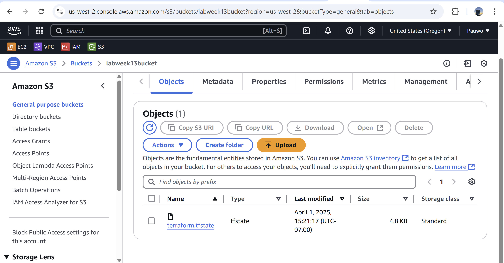
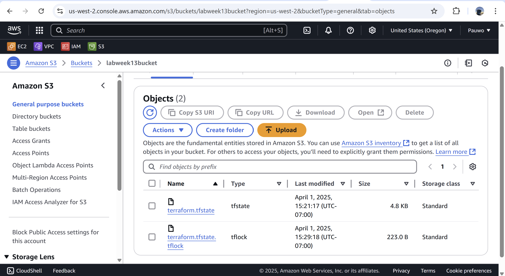

# ACIT4640-Labweek13

**When is the state file created?**  
- The state file is created after running `terraform apply` successfully.

**When is the lock file present?**  
- The lock file is created when Terraform acquires a lock to prevent other processes from modifying the state simultaneously, typically after `terraform apply`.

**Is the lock file always in the bucket after it is created?**  
- No, the lock file is temporary and is deleted after the operation completes successfully or fails.

**State File Only Screenshot**

**State File and Lock Screenshot**

